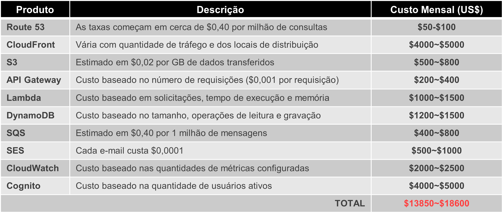

# Projeto de Conclusão - Arquitetura Compute e Storage - Turma 31CLD - FIAP
## Repositório contendo todo o conteúdo do projeto final da matéria de Arquitetura Compute e Storage.

No repositório encontra-se o projeto de diagramas de arquiteturas desenvolvidos no [Draw.io](https://www.drawio.com/), além da apresentação em PowerPoint e do documento explicativo do conteúdo abaixo, caso necessário.

Integrantes:
- **Pedro Modena – RM 348782**
- **José Roberto – RM 348136**
- **João Santino – RM 348314** 
- **Vanderson Gonçalves – RM 347888**
- **Guilherme Gonçalves – RM 347892**  

## Cenário
Nossa empresa de consultoria, especializada em soluções em nuvem para diversos segmentos de mercado, foi incumbida de migrar para a AWS um sistema de e-commerce Brasileiro que atualmente opera em uma infraestrutura local. 

O sistema atual utiliza uma LAMP stack, servidores de mensageria, servidores MySQL, armazenamento NAS para fotos do site e servidores RabbitMQ. A infraestrutura opera com uma média de 60% de consumo de recursos e enfrenta picos de tráfego significativos, com previsão de crescimento de 200% ~ 300% nos próximos meses.

A infraestrutura existente possui 20 servidores Linux com Apache e PHP, 3 servidores de mensageria/fila de processamento assíncrono, 10 servidores MySQL, e armazenamento NAS para fotos do site totalizando 10 TB. Além disso, há um servidor dedicado ao RabbitMQ. O pico de tráfego atinge 50 mil acessos simultâneos e 2000 pedidos/processamento de compra por segundo durante campanhas, com uma média diária de 10 mil acessos e 200 pedidos por segundo.

## Arquitetura AS IS 
Conforme contextualizado anteriormente, esta arquitetura consiste nos seguinte serviços:
- LAMP Stack
- Servidores MySQL
- Armazenamento NAS
- Servidores RabbitMQ
- Média de 60% de consumo de recursos
- Picos de tráfegos significativos
- Previsão de crescimento de 200%~300%

<h5 align="center">Arquitetura AS IS</h5

##
## Objetivo da Migração
Os objetivos da migração para a AWS incluem:

- **Escalabilidade Efetiva:** Garantir que a infraestrutura possa escalar para atender ao aumento esperado de tráfego, especialmente durante picos de demanda.

- **Recuperação Automática:** Implementar um ambiente com recuperação automática para assegurar alta disponibilidade e continuidade do serviço em caso de falhas.

- **Foco em Custos a Longo Prazo:** Estabelecer uma arquitetura com ênfase na otimização de custos, garantindo crescimento sustentável a longo prazo.

## Solução Proposta

A solução de Re-factoring propõe uma reestruturação significativa da aplicação, de forma em que seja arquitetada como microserviços e visando utilizar ao máximo os serviços serverless nativos da AWS.

Refactorar um sistema de e-commerce para seguir uma arquitetura baseada em microserviços e modular é uma abordagem excelente para tornar o sistema mais flexível, escalável e fácil de manter. Cada módulo seria uma etapa da esteira de processos e pode ser desenvolvido, implantado e escalado independentemente, permitindo que otimize recursos e responda rapidamente às demandas específicas de cada parte do sistema. Além disso, a comunicação entre os módulos pode ser facilitada por meio de APIs ou mensagens assíncronas usando serviços como Amazon SQS ou Amazon SNS.

Reescrever a aplicação para ser totalmente em funções Lambdas. Com elas é possível se preocupar com a criação dos códigos e regras de negócios e não com a infraestrutura, já que é totalmente gerenciada pela AWS. Ao utilizar Lambdas, visamos a melhora no desempenho da aplicação, maior escalabilidade e modularidade.

Substituir o banco de dados para o Amazon DynamoDB, proporcionando escalabilidade automática e ajuste dinâmico de capacidade conforme a demanda. Isso otimiza os custos operacionais, pois os recursos são provisionados apenas quando necessários. Os dados contidos no MySQL atual serão mantidos e disponibilizados para consultas.

Transferir o armazenamento de imagens, vídeos e arquivos não estruturados do site para o Amazon S3, um serviço altamente escalável e durável. Utilizar o Amazon CloudFront para distribuição global de conteúdo estático (Front-End), garantindo baixa latência e alta performance.

Utilizar Amazon SQS para processamento assíncrono e mensagens, proporcionando uma arquitetura desacoplada e permitindo maior flexibilidade e escalabilidade.

Além disso, utilizar o Amazon CloudWatch para monitorar a saúde e o desempenho dos recursos da aplicação, incluindo CPU, memória, tráfego de rede, entre outros. Com tais métricas é possível configurar alarmes e gatilhos para o acionamento de ações de auto escalonamento, ajustando a capacidade dos recursos automaticamente em respostas a picos de tráfego ou demanda.

Utilizar o Amazon Cognito para fazer toda a parte de autenticação, autorização e gerenciamento de usuários, proporcionando uma maior segurança e facilidades com questões de acessos.

## Infraestrutura TO BE

### -> A nova infraestrutura consiste em:
- **Amazon Route 53:** Utilizado para o registro do domínio e acessos aos conteúdos. 

- **Amazon CloudFront:** Utilização do Amazon CloudFront para entrega eficiente de conteúdo estático aos usuários. Combinado com um WAF, fornecendo uma maior camada de segurança contra ameaças cibernéticas, essa estratégia é eficiente para proteger seus aplicativos web, melhorar o desempenho e a escalabilidade e mitigar ameaças de segurança.

- **Amazon S3:** Migração do armazenamento do conteúdo estático, como fotos, vídeos, anúncios, para o Amazon S3, proporcionando escalabilidade e durabilidade. 
- Amazon API Gateway: Atuando como a porta de entrada das requisições, fará toda a orquestração das requisições para os módulos de acordo com a demanda.

- **AWS Lambda:** Com a utilização de funções Lambdas, não será necessário provisionar servidores e/ou gerenciá-los. Sendo um serviço Serverless, o foco do business será apenas na qualidade do código. Funções Lambdas farão todo o processamento de regras de negócios para cada etapa da esteira. 

- **Amazon DynamoDB:** Utilização de um banco de dados NoSQL de documentos e chave-valor, oferece um desempenho inferior a 10ms em qualquer escala. É um banco de dados gerenciado, multirregional, multimestre e durável com segurança incorporada, backup e restauração, além de armazenamento em cache na memória.

- **Amazon SQS:** Utilização do Amazon SQS para integração de mensageria com o SES, permitindo o processamento assíncrono e desacoplado, otimizando a arquitetura e aumentando a flexibilidade.

- **Amazon SES:** O serviço de envio de e-mails será utilizado para envio de atualizações sobre o status dos pedidos, transações, informações de rastreamento e afins.

- **Amazon CloudWatch:** Utilizar o CloudWatch para obtenção de métricas para monitoramento e acionamento do escalonamento automático.

- **Amazon Cognito:** Utilizar o Cognito para gerenciar a parte de autenticação, autorização e gerenciamento de usuários.

### -> Arquitetura Macro Solução

<h5 align="center">Arquitetura Macro</h5

##
### -> Arquitetura Geral Solução

<h5 align="center">Arquitetura To Be</h5

##
## Previsão de Custo
### -> Custo Consultoria (inicial): Estimado em $100,000

### -> Custos Mensais Aproximados:
- **Amazon Route 53:** Geralmente cobrado com base no número de registros DNS e consultas. As taxas começam em cerca de $0,40 por milhão de consultas. 

- **Amazon CloudFront:** Os custos dependem da quantidade de tráfego e dos locais de distribuição. Supondo que você lida com 50 TB de tráfego por mês (2000 pedidos/segundo * 3600 segundos * 24 horas * 30 dias * tamanho médio das respostas), a uma taxa média de $0,085 por GB, isso custaria aproximadamente $4,250.

- **Amazon S3:** Custo baseado na quantidade de transferência de dados. Estimado em $0,02 por GB de dados transferidos. Variação estimada de $500 a $800 por mês, considerando armazenamento e transferência de dados.

- **Amazon API Gateway:** Custo baseado no número de requisições. Aproximadamente $0,001 por requisição. Estimativa de $200 a $400 por mês.

- **AWS Lambdas:** Custo baseado em solicitações, tempo de execução e memória alocada. Considerando 10.000.000 solicitações por mês, com um tempo de execução médio de 630ms, valor estimado de $1000 a $1500.

- **Amazon DynamoDB:** Custo baseado no tamanho, operações de leitura e gravação. Aproximado $1200 a $1500.

- **Amazon SQS:** Custo baseado no número de mensagens. Estimado em $0,40 por 1 milhão de mensagens. Variação estimada de $400 a $800 por mês.

- **Amazon SES:** Custo baseado no número de e-mails enviados. Cada e-mail custa $0,0001. Considerando o envio de 5 milhões de e-mails mensais, o custo médio seria aproximadamente $500.

- **Amazon CloudWatch:** Custo baseado nas quantidades de métricas configuradas. Valor aproximado de $2000 a $2500.

- **Amazon Cognito:** Custo baseado na quantidade de usuários ativos. Valor médio de $4000 a $5000.

<h5 align="center">Custos mensais aproximados em US$</h5

##
## Benefícios Esperados
Os principais benefícios da migração para a AWS com a abordagem de Re-factoring incluem:

- **Escalabilidade Efetiva:** A nova arquitetura serverless permite escalar automaticamente em resposta à demanda, garantindo uma experiência consistente aos usuários, mesmo durante picos de tráfego.

- **Otimização de Custos:** A utilização eficiente de recursos, a escalabilidade automática e a migração para serviços gerenciados contribuem para uma redução significativa nos custos operacionais.

- **Eficiência Operacional:** A infraestrutura serverless simplifica a administração, permitindo que a equipe foque mais no desenvolvimento e menos na manutenção da infraestrutura.

- **Alta Disponibilidade e Resiliência:** A arquitetura proposta proporciona alta disponibilidade e recuperação automática em caso de falhas, garantindo a continuidade do serviço.

- **Possibilidade de expansão para multi-regiões:** Com a arquitetura proposta, há uma facilidade maior no crescimento do negócio a nível global, podendo ser escalada em diversas regiões de forma rápida e sustentável. 